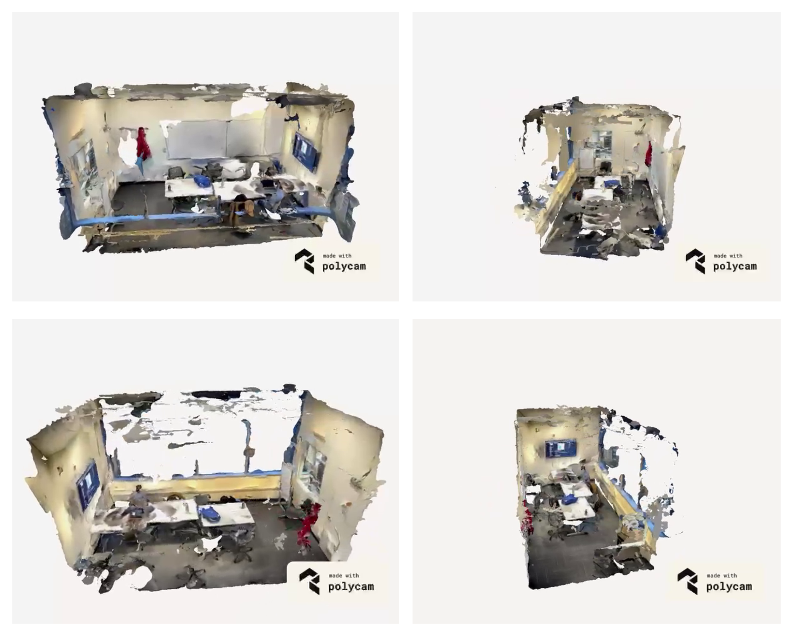

# NeRF Variations and Applications

## Project Abstract
In this project, we explore different variations of the Neural Radiance Fields (NeRF) technique for generating new views of intricate scenes using sparse inputs. We compare the performance of various NeRF implementations and investigate their strengths and weaknesses. Our focus is on understanding NeRF variations such as PixelNeRF, RegNeRF, and SNeRG, and their applications in constrained resource environments, sparse coding, real-time performance, and representation from one or few images. We visually compare these variations with prior works in neural rendering and view synthesis.

## Experiments and Results

Our objective was to compare different implementations of NeRF and evaluate their performance. We conducted experiments using custom environments and objects, such as library rooms and a 3D-printed Yoda toy. We utilized existing NeRF implementations available on GitHub repositories and obtained the following results:

### NeRF
We used NerfStudio for NeRF implementation. The output was a 3D render viewed on PolyCam. The fine-tuned hyperparameters for this implementation were Polygon Size (5 mm) and Smoothing (10%).

### PixelNeRF and RegNeRF
PixelNeRF and RegNeRF address sparsity in inputs. We fed four images to each model and obtained 3D renders of library rooms in the NYU Dibner Library.

PixelNeRF Output:

RegNeRF Output:

### SNeRG
SNeRG was implemented on screenshots from a video of a smaller subsection of a room. The rendered views were detailed at the center but had artifacts at the outer fringes.

Entire View:

Focus on the Center:

We also plotted the Peak Signal to Noise Ratio (PSNR) against the number of input views for each architecture. Higher PSNR values indicate better performance.

We summarize our best results in terms of PSNR in the following table:

| Architecture | Best PSNR |
|--------------|-----------|
| NeRF         | 24.324    |
| PixelNeRF    | 23.173    |
| RegNeRF      | 25.190    |
| SNeRG        | 23.981    |

## Conclusion

Through this project, we have gained a comprehensive understanding of NeRF variations and their applications. We have compared the performance of different NeRF implementations and identified their strengths and weaknesses. Our work provides insights into addressing challenges such as sparse inputs, real-time performance, and representation from limited images. Further experiments and research will contribute to overcoming these challenges and improving the capabilities of NeRF.

Please refer to the full report for a detailed analysis and discussion of the results.

<!-- # nerf-deep-dive-testbench
Code repository for nerf testbench

The code contains four different implementations of nerf tested for our database:

1. NeRF - (https://www.matthewtancik.com/nerf)
2. Pixel-NeRF - (https://alexyu.net/pixelnerf/)
3. regNeRF - (https://m-niemeyer.github.io/regnerf/)
4. sNeRG - (https://phog.github.io/snerg/)
 -->
